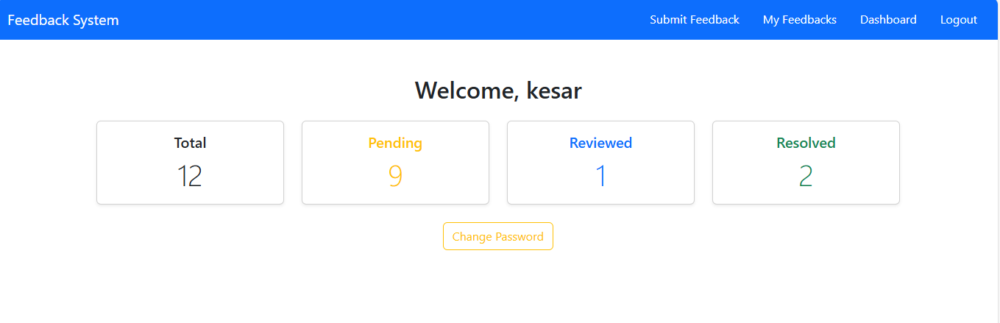
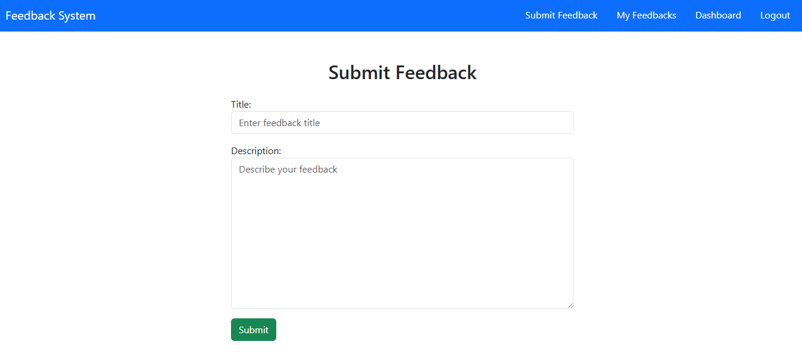
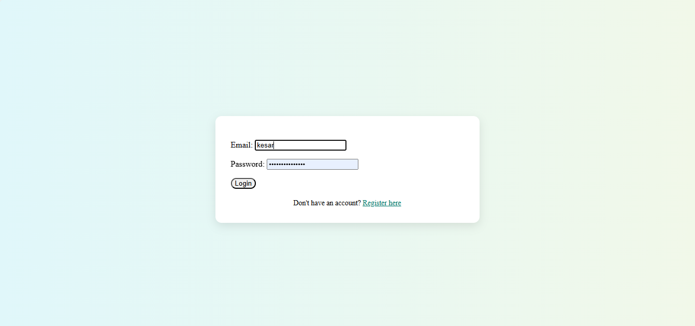

# 📝 User Feedback System

A secure and scalable **User Feedback Management System** built with **Django** and **Django REST Framework (DRF)**. It supports both **web-based** and **API-based** interaction modes, with role-based access for Users and Admins.

> 🔐 Built with custom user authentication via **email**, beautiful Bootstrap UI, and full CRUD functionality for feedback.

---

## Features

### Authentication & Authorization

- Email-based login and registration
- Password hashing and secure session management
- Password change with validations
- Logout functionality
- Access control: Users vs Admins

### Feedback Management

- Authenticated users can:
  - Submit new feedback
  - View and filter their own feedback
  - Export feedback to CSV
- Admins can:
  - View, filter, and sort all users' feedbacks
  - Mark feedbacks as `Pending`, `Reviewed`, or `Resolved`
  - **Receive real-time email notifications on new feedback submissions**

### UI & UX

- Responsive design with **Bootstrap 5**
- Role-based navigation bars
- Clean dashboard with:
  - Feedback count summary
  - Password change shortcut
- Feedback listing with:
  - Pagination
  - Keyword search
  - Sorting by status/date

### REST API Support (DRF)

- Full API endpoints for feedback CRUD operations
- Token-based authentication supported
- JSON response for external integrations
- Postman-compatible

---

## Tech Stack

| Layer     | Technology                         |
| --------- | ---------------------------------- |
| Framework | Django 5.2.1                       |
| API Layer | Django REST Framework              |
| Templates | Django Templates + Bootstrap 5     |
| Database  | PostgreSQL                         |
| Auth      | Custom User Model with email login |
| Dev Tools | Postman, Git, VS Code              |

## ⚙️ Setup Instructions

```
# 1. Clone repository
git clone https://github.com/yourusername/user-feedback-system.git
cd user-feedback-system

# 2. Set up virtual environment
python -m venv venv
venv\Scripts\activate

# 3. Install dependencies
pip install -r requirements.txt

# 4. Configure database (PostgreSQL recommended)
# Update settings.py with DB credentials

# 5. Migrate and seed
python manage.py makemigrations
python manage.py migrate
python manage.py createsuperuser

# 6. Run the server
python manage.py runserver
```
### UI

#### Dashboard


#### Feedback listing


#### Submit Feedback Page


#### Login Page
